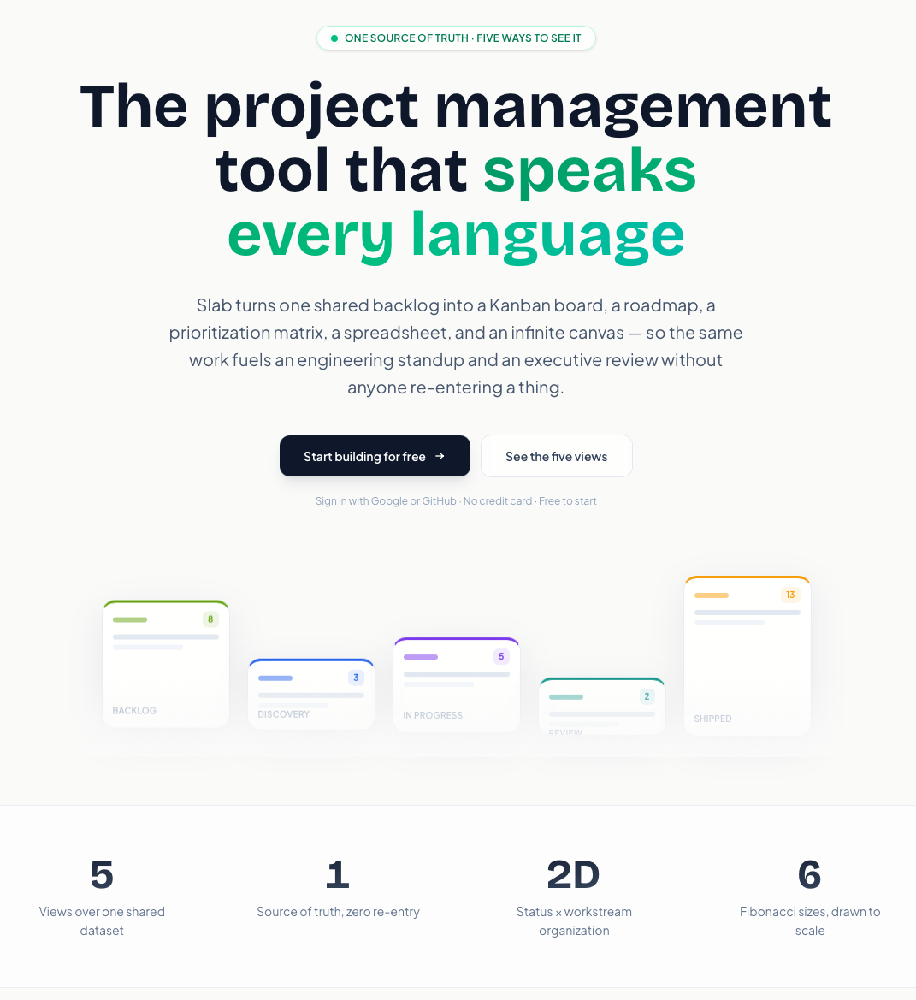
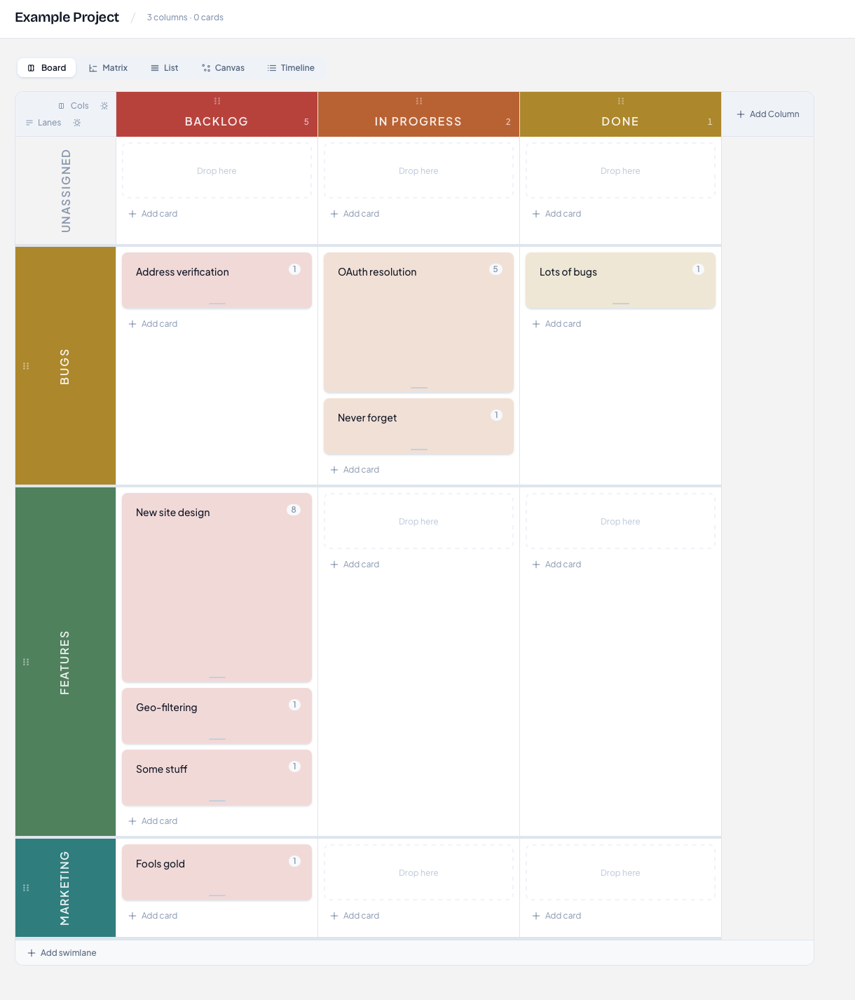
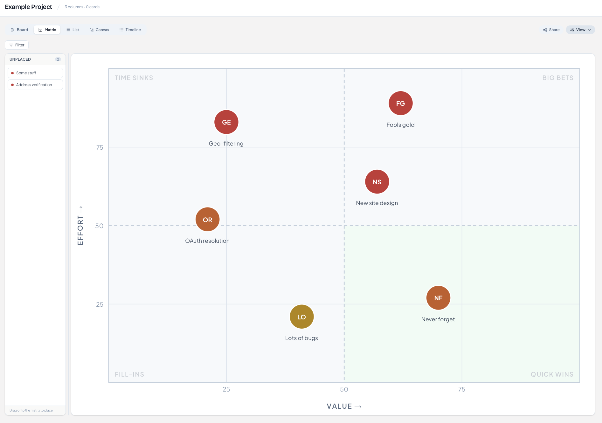
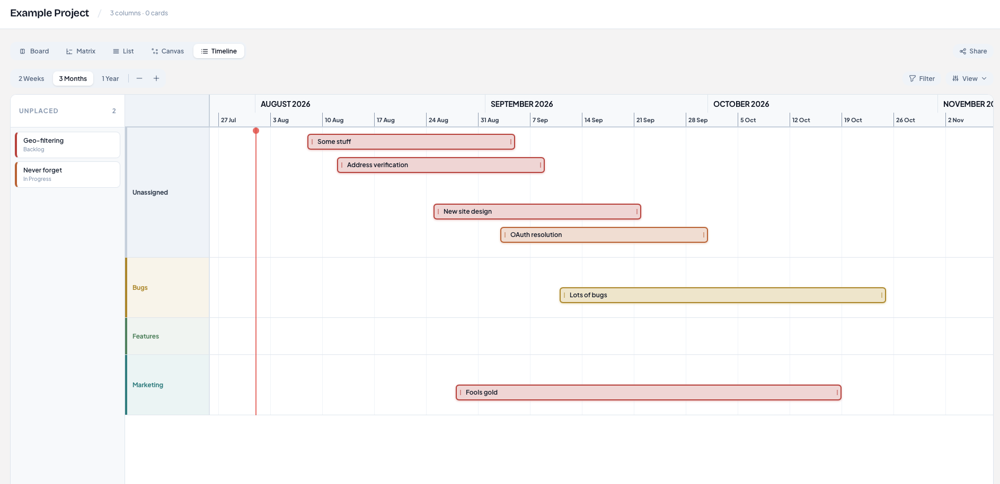

# Slabboard

**One shared backlog, five ways to see it: a visual product and project management tool where the same work fuels an engineering standup and an executive review without anyone re-entering a thing.**

🔗 **Live:** [slabboard.app](https://slabboard.app) · Free to start, sign in with Google or GitHub

## Why I built it

After fourteen years running product orgs, the pattern was always the same: the team's working board and the executive narrative live in different tools, and someone (usually a PM) spends their week re-entering one into the other until they drift apart by Friday. I wanted the working board and the story for the room to be the same data, reshaped per audience. Slabboard is that: enter the work once, and it becomes a standup board, a quarter-by-quarter roadmap, a prioritization matrix, a bulk-edit list, or a stakeholder canvas depending on who's looking.

## What it does

- **Five views over one dataset:** Kanban, Timeline, Prioritization Matrix, List, and infinite Canvas, all reading the same backlog with zero re-entry
- **Fibonacci sizing as a visual language:** estimate in 1 · 2 · 3 · 5 · 8 · 13 and each card physically grows to match, so relative effort is visible across the whole board instead of hidden in a field
- **True 2D organization:** columns for status, swimlanes for team or workstream; drag sideways to change stage, up or down to reassign
- **Value vs. effort scoring** that automatically sorts quick wins from time sinks in the matrix view
- **Public read-only share links:** hand a stakeholder a link, not a login; they see exactly the view you configured and nothing they can touch
- **Optimistic, real-time drag-and-drop** with clean rollback and multi-select batch moves

## How it's built

**Stack:** React, Next.js, SQL, deployed on Vercel. Google and GitHub OAuth.

Every view is a projection over one canonical backlog, so a card moved in the Kanban board is already moved in the roadmap and the matrix. Writes land optimistically in the UI and roll back cleanly if the network blinks.

## Product decisions worth noting

- **Five views instead of five tools.** The rejected alternative was the industry default: separate trackers for the team and the deck, kept in sync by human labor. Making views projections over one dataset eliminates the sync problem instead of managing it.
- **Estimates you can see.** Most tools store effort as a number in a field, which means nobody feels it. Scaling card height to the Fibonacci estimate makes the weight of the work legible at a glance, which changes how planning conversations actually go.
- **Share links instead of stakeholder seats.** Executives and partners don't want another login, and teams don't want executives editing the board. Read-only links with a pinned configuration solve both at once.

## Status & roadmap

Live at [slabboard.app](https://slabboard.app), in active development.

---

*This is a product showcase repo. The application code is private; if you're evaluating my work and want a walkthrough, reach me on [LinkedIn](https://www.linkedin.com/in/sam-l-richards).*
